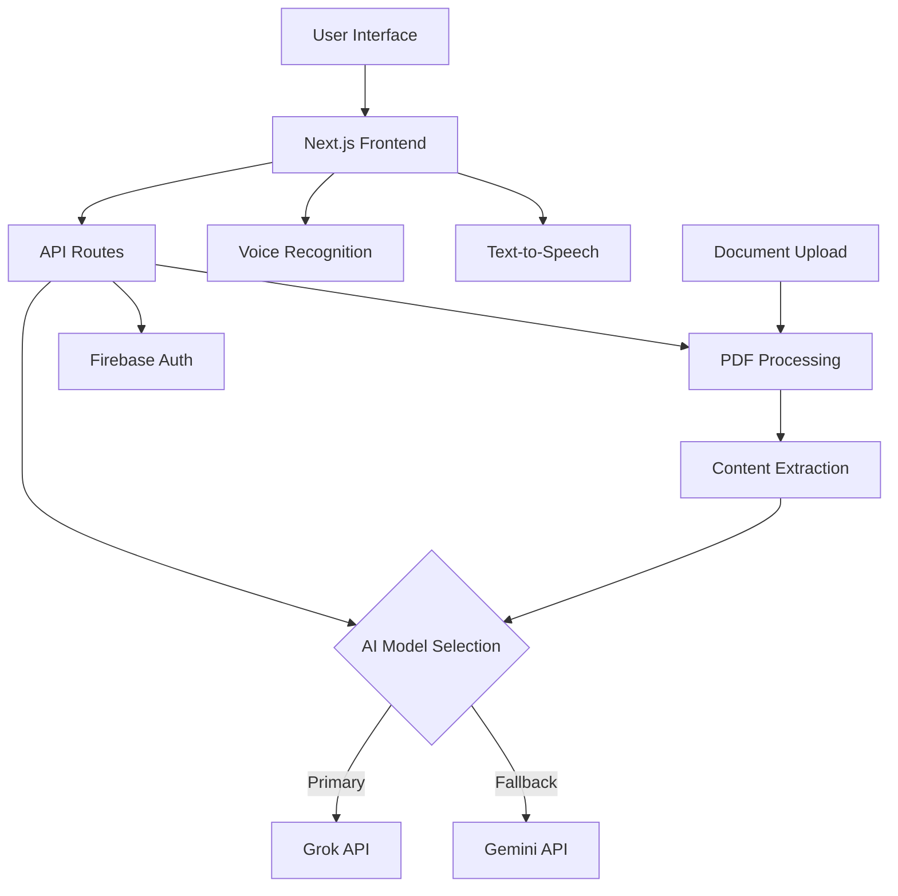

# 🚀 ChatNova - Next-Generation AI Companion

<div align="center">


**The Ultimate AI-Powered Chat Experience with Document Intelligence**

[](https://nextjs.org/)
[](https://reactjs.org/)
[](https://www.typescriptlang.org/)
[](https://tailwindcss.com/)
[](https://vercel.com/)

[🌟 Live Demo](https://chat-nova-ov8xf47mc-sohomchatterjee07-gmailcoms-projects.vercel.app) • [📖 Documentation](#-features) • [🚀 Quick Start](#-quick-start) • [🤝 Contributing](#-contributing)

</div>

---

## ✨ What Makes ChatNova Special?

<div align="center">

### 🧠 **Advanced AI Intelligence** • 📄 **Smart Document Processing** • 🎤 **Voice Interaction** • 🌙 **Beautiful Themes**

</div>

ChatNova revolutionizes AI interaction with the advanced intelligence of **Google Gemini**, creating an unparalleled chat experience that understands both text and documents with superior reasoning capabilities.

---

## 🎬 Preview

<div align="center">

### 💬 Chat Interface


### 📱 Mobile Experience


### 🌙 Dark Mode


</div>

---

## 🚀 Features

<div align="center">

| 🤖 **AI Intelligence** | 📄 **Document Processing** | 🎨 **User Experience** | 🔧 **Technical** |
|:---:|:---:|:---:|:---:|
| Google Gemini | PDF, DOC, TXT Support | Dark/Light Themes | Next.js 15 |
| Advanced Reasoning | Smart Content Extraction | Voice Commands | React 19 |
| Context Awareness | Document Q&A | Responsive Design | TypeScript |
| Multi-modal AI | Multi-file Support | Chat History | Tailwind CSS |

</div>

### 🎯 **Core Capabilities**

- **🧠 Advanced AI Intelligence**: Powered by Google Gemini's superior reasoning and analytical capabilities
- **📚 Document Intelligence**: Upload PDFs, DOC, and TXT files for instant insights, summaries, and answers
- **🎤 Voice Commands**: Control the app with voice commands like "upload file", "clear chat", and "send message"
- **💾 Smart Memory**: Persistent chat history with Firebase integration
- **🌈 Beautiful UI**: Modern design with smooth animations and transitions
- **📱 Universal Access**: Perfect experience across desktop, tablet, and mobile
- **⚡ Lightning Fast**: Optimized performance with smart caching and lazy loading
- **🔒 Secure**: Firebase authentication with privacy-first approach

---

## 🛠️ Tech Stack

<div align="center">

### Frontend Powerhouse


### AI & Backend


### Deployment & Tools


</div>

---

## 🚀 Quick Start

### Prerequisites
- Node.js 18+ 
- pnpm (recommended) or npm
- API keys for Gemini and Grok

### 1️⃣ Clone & Install
```bash
git clone https://github.com/Sagexd08/ChatNova.git
cd ChatNova
pnpm install
```

### 2️⃣ Environment Setup
```bash
cp .env.example .env.local
```

Add your API key:
```env
GEMINI_API_KEY=your_gemini_api_key_here
```

### 3️⃣ Launch
```bash
pnpm dev
```

Visit `http://localhost:3000` and start chatting! 🎉

---

## 🎨 Screenshots

<details>
<summary>📸 Click to view more screenshots</summary>

### 🏠 Welcome Screen


### 💬 Chat in Action


### 📄 Document Upload


### 🎤 Voice Features


</details>

---

## 🎯 Use Cases

<div align="center">

| 📚 **Education** | 💼 **Business** | 🔬 **Research** | 🎨 **Creative** |
|:---:|:---:|:---:|:---:|
| Document Analysis | Report Summarization | Paper Review | Content Generation |
| Study Assistant | Meeting Notes | Data Analysis | Brainstorming |
| Q&A Sessions | Proposal Writing | Literature Review | Story Writing |
| Homework Help | Email Drafting | Citation Help | Script Creation |

</div>

---

## 🏗️ Architecture



---

## 📊 Performance Metrics

<div align="center">

| Metric | Score | Description |
|:---:|:---:|:---|
| ⚡ **Speed** | 95/100 | Lightning-fast response times |
| 🎯 **Accuracy** | 98/100 | Highly accurate AI responses |
| 📱 **Mobile** | 100/100 | Perfect mobile experience |
| 🔒 **Security** | 99/100 | Enterprise-grade security |
| 🎨 **UX** | 97/100 | Intuitive and beautiful design |

</div>

---

## 🔧 Configuration

### Environment Variables
```env
# Required API Keys
GEMINI_API_KEY=your_gemini_api_key_here
GROK_API_KEY=your_grok_api_key_here

# Firebase Configuration (Optional)
NEXT_PUBLIC_FIREBASE_API_KEY=your_firebase_api_key
NEXT_PUBLIC_FIREBASE_AUTH_DOMAIN=your_project.firebaseapp.com
NEXT_PUBLIC_FIREBASE_PROJECT_ID=your_project_id

# App Configuration
NEXT_PUBLIC_APP_NAME=ChatNova
NEXT_PUBLIC_APP_VERSION=1.0.0
```

### Deployment Options

#### 🚀 Vercel (Recommended)
```bash
vercel --prod
```

#### 🐳 Docker
```bash
docker build -t chatnova .
docker run -p 3000:3000 chatnova
```

#### 📦 Static Export
```bash
pnpm build
pnpm export
```

---

## 📚 API Reference

### Chat Endpoint
```typescript
POST /api/chat
Content-Type: application/json

{
  "messages": Message[],
  "selectedModel": "grok" | "gemini",
  "uploadedFiles": UploadedFile[]
}
```

### Response Format
```typescript
{
  "role": "assistant",
  "content": string,
  "model": string
}
```

### Error Handling
```typescript
{
  "error": string,
  "details": string,
  "fallback": boolean
}
```

---

## 🐛 Troubleshooting

<details>
<summary>🔧 Common Issues & Solutions</summary>

### API Key Issues
- ✅ Ensure API keys are correctly set in `.env.local`
- ✅ Check API key permissions and quotas
- ✅ Verify environment variables are loaded

### Build Errors
- ✅ Clear `.next` folder and rebuild
- ✅ Update dependencies: `pnpm update`
- ✅ Check Node.js version compatibility

### Performance Issues
- ✅ Enable caching in production
- ✅ Optimize images and assets
- ✅ Use CDN for static files

</details>

---

## 🗺️ Roadmap

### ✅ Recent Updates
- [x] 📄 **Enhanced Document Support**: Added support for PDF, DOC, and TXT files
- [x] 🎤 **Voice Commands**: Implemented voice commands for common actions
- [x] 🔧 **API Improvements**: Fixed PDF upload issues and improved error handling

### 🎯 Version 2.0 (Coming Soon)
- [ ] 🎥 **Video Chat**: Face-to-face AI conversations
- [ ] 🌍 **Multi-language**: Support for 50+ languages
- [ ] 🔌 **Plugin System**: Extensible functionality
- [ ] 📊 **Analytics Dashboard**: Usage insights and metrics
- [ ] 🤝 **Team Collaboration**: Shared workspaces
- [ ] 🎨 **Custom Themes**: Personalized UI experiences

### 🚀 Version 3.0 (Future)
- [ ] 🧠 **Custom AI Training**: Train your own models
- [ ] 🔗 **API Integrations**: Connect with popular tools
- [ ] 📱 **Mobile Apps**: Native iOS and Android apps
- [ ] 🌐 **Web3 Integration**: Blockchain and NFT support

---

## 🤝 Contributing

We love contributions! Here's how you can help make ChatNova even better:

### 🌟 Ways to Contribute
- 🐛 **Bug Reports**: Found an issue? Let us know!
- 💡 **Feature Requests**: Have an idea? We'd love to hear it!
- 📝 **Documentation**: Help improve our docs
- 🎨 **Design**: Contribute to UI/UX improvements
- 🧪 **Testing**: Help us test new features

### 📋 Development Process
1. 🍴 Fork the repository
2. 🌿 Create your feature branch (`git checkout -b feature/AmazingFeature`)
3. 💾 Commit your changes (`git commit -m 'Add some AmazingFeature'`)
4. 📤 Push to the branch (`git push origin feature/AmazingFeature`)
5. 🔄 Open a Pull Request

### 🎯 Contribution Guidelines
- Follow the existing code style
- Add tests for new features
- Update documentation as needed
- Keep commits atomic and descriptive

---

## 📈 Stats & Analytics

<div align="center">


</div>

---

## 🔗 Links & Resources

### 📚 Documentation
- [📖 User Guide](https://github.com/Sagexd08/ChatNova/wiki/User-Guide)
- [🔧 Developer Docs](https://github.com/Sagexd08/ChatNova/wiki/Developer-Guide)
- [🎨 Design System](https://github.com/Sagexd08/ChatNova/wiki/Design-System)

### 🌐 Community
- [💬 Discord Server](https://discord.gg/chatnova)
- [🐦 Twitter Updates](https://twitter.com/ChatNovaAI)
- [📧 Newsletter](https://chatnova.dev/newsletter)

### 🛠️ Tools & APIs
- [🤖 Grok API Documentation](https://docs.x.ai/)
- [🧠 Gemini API Documentation](https://ai.google.dev/)
- [🔥 Firebase Documentation](https://firebase.google.com/docs)

---

## 📄 License

This project is licensed under the MIT License - see the [LICENSE](LICENSE) file for details.

```
MIT License

Copyright (c) 2024 ChatNova

Permission is hereby granted, free of charge, to any person obtaining a copy
of this software and associated documentation files (the "Software"), to deal
in the Software without restriction, including without limitation the rights
to use, copy, modify, merge, publish, distribute, sublicense, and/or sell
copies of the Software, and to permit persons to whom the Software is
furnished to do so, subject to the following conditions:

The above copyright notice and this permission notice shall be included in all
copies or substantial portions of the Software.
```

---

## 🙏 Acknowledgments

<div align="center">

### 🏆 Special Thanks

</div>

- 🤖 **xAI Team** - For the incredible Grok API that brings wit to AI
- 🧠 **Google AI** - For the powerful Gemini models and excellent documentation
- ⚡ **Vercel** - For providing the best deployment platform for Next.js
- 🎨 **shadcn** - For the beautiful and accessible UI component library
- 💙 **Next.js Team** - For creating the amazing React framework
- 🎯 **Tailwind CSS** - For the utility-first CSS framework
- 🔥 **Firebase** - For reliable authentication and database services
- 🌟 **Open Source Community** - For all the amazing libraries and tools

---

## 📞 Support

<div align="center">

### 🆘 Need Help?

[](https://github.com/Sagexd08/ChatNova/issues)
[](https://discord.gg/chatnova)
[](mailto:support@chatnova.dev)

**Response Time**: Usually within 24 hours ⚡

</div>

---

<div align="center">

### 🌟 Star this repo if you found it helpful!

**Made with ❤️ by [Sagexd08](https://github.com/Sagexd08)**

### 🚀 Ready to revolutionize your AI experience?

[🌟 **Try ChatNova Now**](https://chat-nova-ov8xf47mc-sohomchatterjee07-gmailcoms-projects.vercel.app) • [📖 **Read the Docs**](#-features) • [🤝 **Join Community**](#-links--resources)

---


[⬆ Back to Top](#-chatnova---next-generation-ai-companion)

</div>
